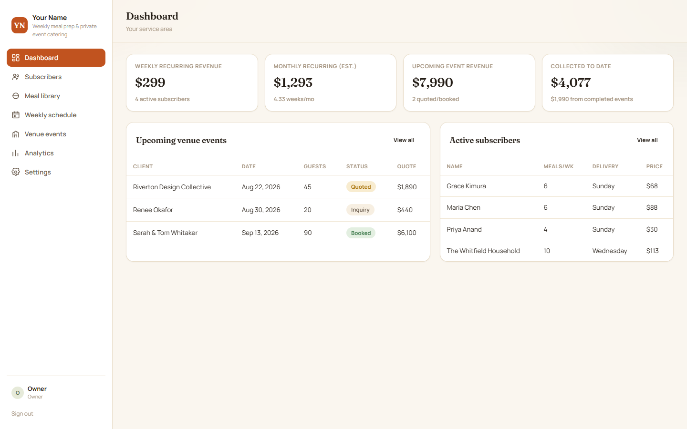
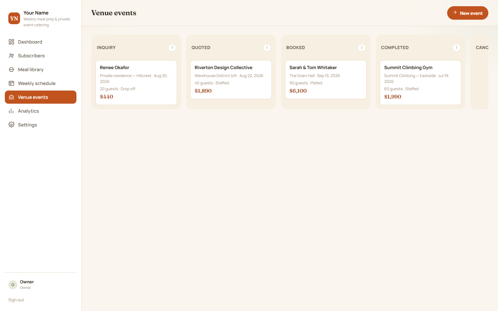
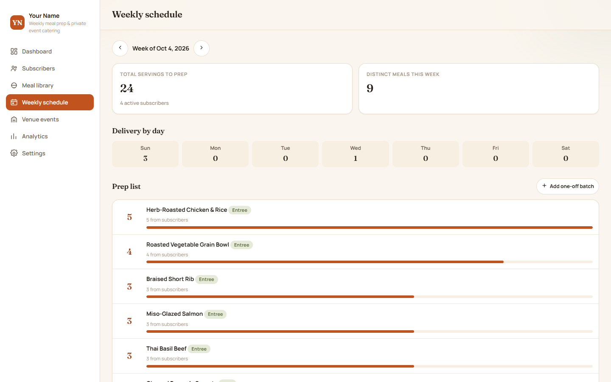
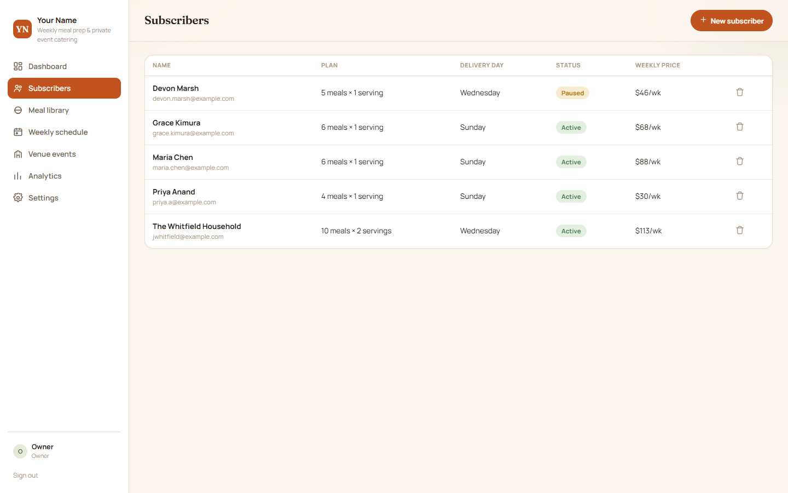
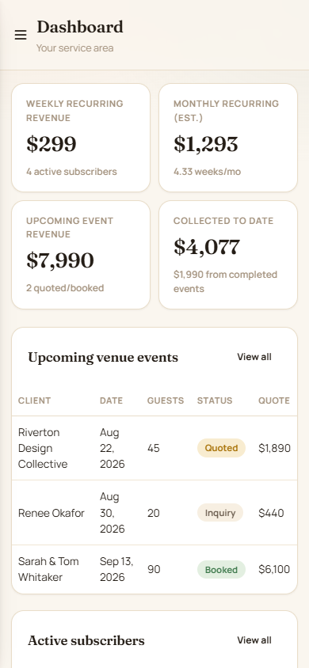
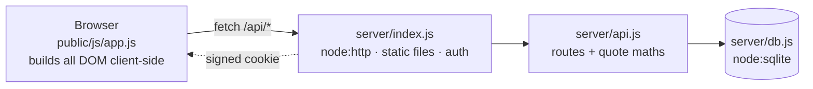

# catering-crm

A CRM for independent chefs who run two businesses at once: weekly meal-prep subscriptions,
and one-off catering for private and venue events. Zero npm dependencies. Clone it and run it.



## What it does

| Area | What you get |
|---|---|
| **Subscribers** | Weekly customers with a standing meal order that prices itself from the menu and feeds the prep list. Active / paused / cancelled, delivery day, dietary notes. |
| **Meal library** | The menu: price, unit, category, tags. Subscriptions and prep quantities both read from it. |
| **Weekly schedule** | Every active subscription rolled up into a prep list by meal and delivery day, plus one-off batches. Negative quantities handle skips. |
| **Venue events** | Inquiry → quoted → booked → completed board. Each event carries a quote: guests × per-person rate by service type, add-ons, travel, discount, tax, deposit. Totals are computed on the server, so the number on screen is the number billed. |
| **Analytics** | Recurring revenue, event revenue, collected to date, revenue by month, most-ordered meals. |
| **Settings** | Business name, brand colours, pricing, tax, deposit %, travel fees, service types and add-ons. Nothing needs a code change. |

<p>


</p>
<p>


</p>

## Run it

Needs Node 22 or newer (it uses the built-in `node:sqlite`).

```bash
node server/index.js     # http://localhost:3011
```

No `npm install`. The first boot creates `data/chef.db` and seeds demo data: 5 subscribers,
11 meals, 4 events and 6 payments, so there's something to look at straight away.

Sign in as `owner@example.com` / `changeme2026`, or set `ADMIN_EMAIL` and `ADMIN_PASSWORD`
before the first boot. All settings are in [`.env.example`](.env.example).

With Docker:

```bash
docker build -t catering-crm .
docker run -p 3011:3011 -v catering-data:/app/data --env-file .env catering-crm
```

## How it's built



- **No dependencies.** `node:http` and `node:sqlite`, nothing to install and nothing to break
  on a redeploy.
- **No server-side HTML templating.** The server sends static files and JSON, and the client
  renders everything.
- **Stateless sessions.** HMAC-signed cookies, so any process can verify any session. Set
  `SESSION_SECRET` and logins survive restarts.
- **Built for phones.** Safe-area insets, 16px inputs so iOS doesn't zoom, about 44px touch
  targets, bottom-sheet modals. On touch devices you open a card and change its status, because
  iOS doesn't support HTML drag-and-drop.

## Demo mode

`DEMO_MODE=1` resets all business data to the seed set every `DEMO_RESET_MIN` minutes and on
every boot, and shows a banner saying so. User accounts are kept, so logins still work.
Handy for showing the app to someone without them breaking it.

## License

MIT. Built by [Dime Data](https://dimedata.cloud).
